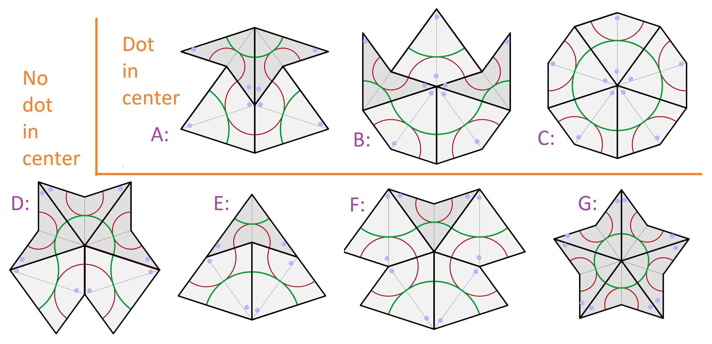
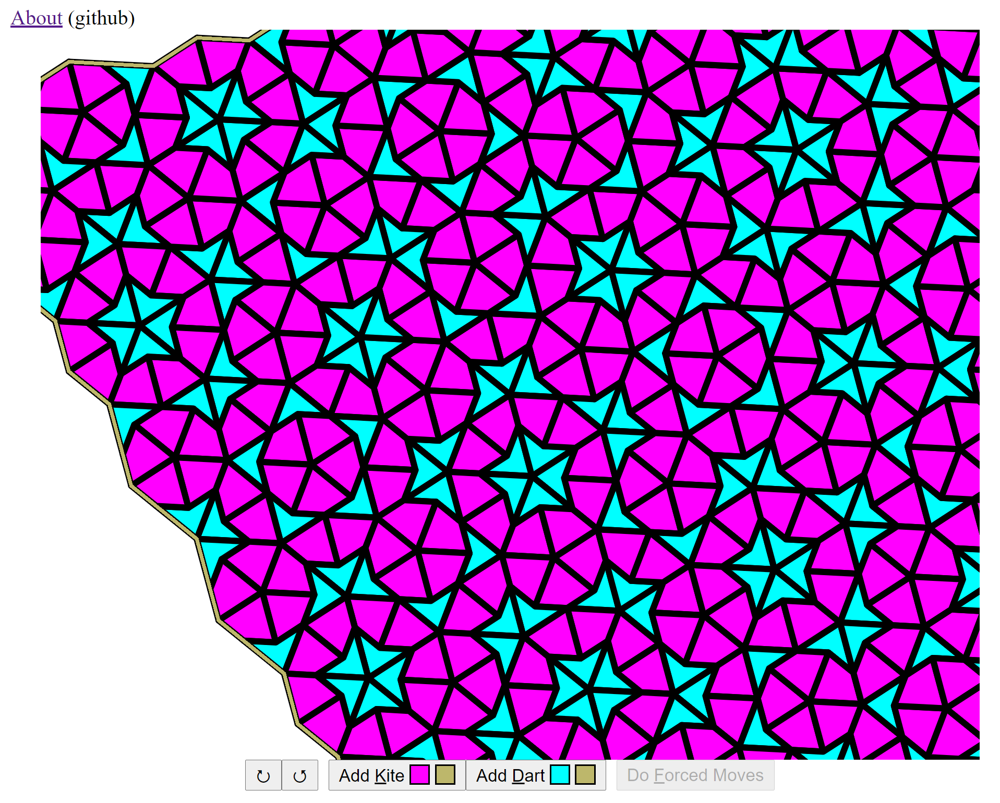

# Penrose Tilings

They look so cool.
I want to do something with them.

I want to build them outward.
The recursive algorithm didn't seem like as much fun.
I want to place the tiles one at a time and sometimes I want to see two or more options.

This is similar to some of my past "fun" projects.
However, this is harder.
There is no grid known in advance.
If two pieces meet up perfectly, we need to know that, and round off error will make `==` useless.
If two pieces overlap, we need to call that an error.

## Status

The basic algorithm is in place!
It's time to add some niceties.

Now that the program finds _all_ forced moves, I am surprised by just how many forced moves there are!

## References

- https://www.math.brown.edu/reschwar/MFS/handout7.pdf – `fromDot` and `toDot` refer to figure 1 in this document.
- https://www.thingiverse.com/thing:1254773 – I want to pretend that I'm playing with the physical objects, even though I'm only working with computer images.
- [KITES AND Darts cutouts](https://www.google.com/search?safe=off&sxsrf=ALeKk025yXv3hIDOT3tY-QQTr0bzdipS_A:1604617616423&source=univ&tbm=isch&q=KITES+AND+Darts+cutouts&sa=X&ved=2ahUKEwi0t5u4wuzsAhWY9Z4KHfcyBhIQjJkEegQIDBAB&biw=1536&bih=722&dpr=2.5) – Includes angles and more.
- [Penrose Instructions](http://static1.squarespace.com/static/5754f47fcf80a16bffa02c45/t/57c6b9c5b3db2bd469e914e2/1472641508501/Penrose-instructions.pdf)
- [Penrose Tiling](https://www.google.com/search?q=penrose+tiling&safe=off&sxsrf=ALeKk01VERXgACpbcT5Z9Zlr9LZ8DXtdDQ:1604429919611&tbm=isch&source=iu&ictx=1&fir=btYSlQ2HpyTX4M%252Cn_n05pddisF3gM%252C%252Fm%252F0cgpp&vet=1&usg=AI4_-kS8TskUx1y1c4WgFqBovgMj6DNPaw&sa=X&ved=2ahUKEwilirObh-fsAhUbHzQIHRiOBnkQ_B16BAgQEAM#imgrc=btYSlQ2HpyTX4M) – More pictures.

I created the following picture from two sources.
Wikipedia says these are the only 7 ways that kites and darts can share a vertex.
I added the lavender dots to match the pictures in the handout.
The word `dot` in the code refers to vertices that contain a lavender dot.

## Tools

This is a VS Code Project.
And I've added the [Live Server](https://marketplace.visualstudio.com/items?itemName=ritwickdey.LiveServer) extension to allow me to run the program.
(You can't run JavaScript modules or threads without a web server.)

## GUI

### Whenever I get to the GUI it might look something like this.

/pic5851096.jpg>)

### Here's a snapshot of what I have now.

Or try it yourself: https://tradeideasphilip.github.io/penrose-tiling/
